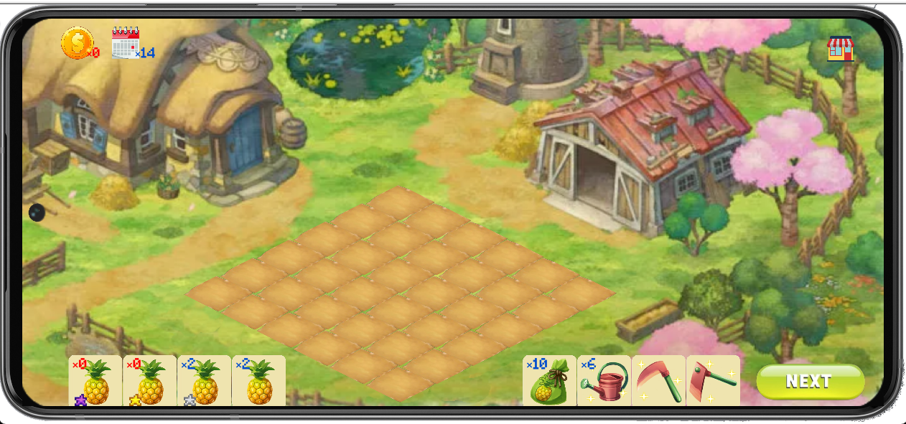
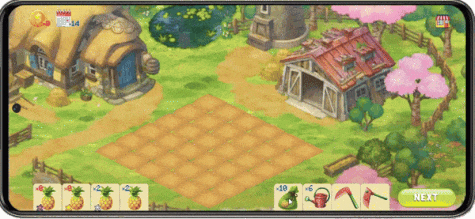
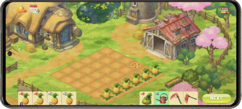
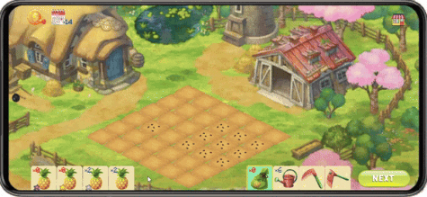

# Last 14 Days of Pineapples

> "Fill that darn land with darn pineapples in 14 days an' make yer ol' Pop pround!"

**A *strategy* [Solar2D](https://solar2d.com/) game** made by students of "Introduce to Game Design" college course with only one programmer in a mere week.

> "By the by, a pineapple takes **5** days to grow."

## Pop you're jokin', right?
> "Don't be yellow-belly, young'un. Here's the lowdown..."

Plants, Waters and Grows:   

Harvest, Sell and Buy:   

> "Y'see the magic tricks those *pineapples* can conjur'!"

> "Time to yank yer Pop's eye outta of his noggin with those dusty paws of yers!"
## Alrighty Pop!
Download the whole project to play within Solar2D Simulator or download **apk file**, **built project**(exe file included) in Release page to play in **Androids** or **Windows** respectively!